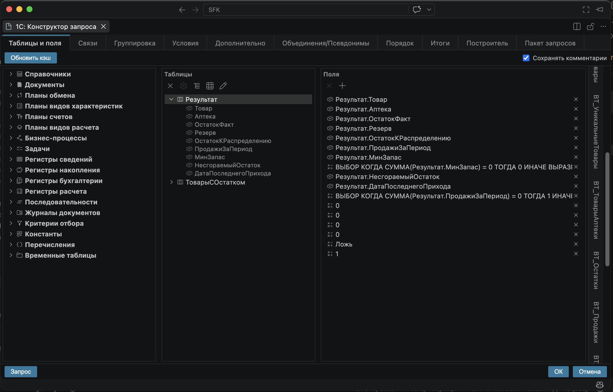

# 1C: Query Constructor

> Форк проекта [AlekseyUAM/query_console_vscode](https://github.com/AlekseyUAM/query_console_vscode)
> (автор оригинала — Aleksey Yudanov). Развивается и поддерживается отдельно.

Визуальный конструктор запросов 1С для VS Code — аналог «Конструктора запроса» из
Конфигуратора/EDT. Работает с конфигурацией 1С, выгруженной в файлы (`*.xml` —
метаданные, `*.bsl` — код): строит дерево «таблицы → поля → типы → связи», даёт собрать
запрос мышью и генерирует текст на языке запросов 1С (SDBL).

 

## Возможности

- Парсинг метаданных конфигурации.
- Визуальное построение запросов с учетом всех возможностей языка запросов 1С.
- Открытие сохраненного текста запроса с проверкой синтаксиса и наличия таблиц.
- Позволяет сохранять комментарии внутри текста запроса.

## Команды

Доступны в палитре команд VS Code (`Ctrl+Shift+P`):

- **`1С: Конструктор запроса`** (`1c.queryConstructor`) — открывает webview-панель конструктора.
- **`1С: Распарсить метаданные в YAML`** (`1c.parseMetadata`) — парсит выгрузку конфигурации в YAML.

## Использование

Расширение добавляет для файлов `.bsl` в контекстное меню (правая кнопка мыши)
команду **«1С: Конструктор запроса»**.

- Если курсор стоит **внутри текста сохранённого запроса**, команда открывает этот
  запрос в конструкторе.
- Если курсор **в другом месте**, расширение предложит создать новый запрос.

По нажатию **ОК** в конструкторе:

- для открытого существующего запроса — он **заменяется** на собранный конструктором;
- для нового — текст запроса **вставляется** в позицию курсора.

Текст вставляется в формате, требуемом синтаксисом языка 1С (строковый литерал с
переносами `|`).

### Сохранение комментариев

Комментарии `//…` в тексте запроса сохраняются при цикле *открыть → править →
сохранить*. В шапке конструктора есть галочка **«Сохранять комментарии»** (включена по
умолчанию); если её снять — комментарии при вставке убираются.

Комментарии привязываются к смысловым элементам запроса (полю, контейнеру пакета), а не
к позиции в тексте, поэтому переживают перестановку полей и удаляются вместе со своим
полем/таблицей.

**Сохраняются 4 вида комментариев:**

- хвост строки после поля: `Поле КАК Син, // комментарий`;
- отдельной строкой перед полем;
- отдельной строкой перед `ВЫБРАТЬ`;
- отдельной строкой после `ИЗ`.

**Ограничения:**

- только однострочные комментарии `//…`;
- сохраняются только перечисленные 4 позиции — остальные отбрасываются (например,
  хвостовые комментарии на строках ключевых слов `ВЫБРАТЬ //…`, `ИЗ //…`);
- комментарий удаляется при удалении или переименовании его «якоря» — поля (удаление,
  смена синонима/выражения) или контейнера (переименование/смена типа временной таблицы);
- при снятой галочке «Сохранять комментарии» все комментарии теряются при вставке.

### Кнопка «Обновить кэш»

Конструктор работает не с выгрузкой напрямую, а с кэшем разобранных метаданных.

- При **первом открытии** конструктора, если кэш ещё не построен, выполняется парсинг
  метаданных из каталога выгрузки. Путь берётся из настройки
  `queryConsole.metadataPath`; если она пустая — выгрузка ищется в `src/cf` корня
  рабочей области.
- Результат парсинга сохраняется в каталоге из настройки
  `queryConsole.parserOutputPath` (по умолчанию `tmp/parser_data`).
- После **изменения метаданных** конфигурации нажмите **«Обновить кэш»** — это
  перепарсит выгрузку и перестроит кэш.

## Настройки

- `queryConsole.metadataPath` — путь к каталогу выгрузки `cf` (пусто → автоопределение).
- `queryConsole.parserOutputPath` — каталог результата парсинга (по умолчанию `tmp/parser_data`).

## Разработка

Архитектура, структура кода, сборка из исходников, установка vsix, парсер метаданных (CLI), тесты и
процесс релиза — в [`docs/DEVELOPMENT.md`](docs/DEVELOPMENT.md).

## 

- Обзорная статья: [Конструктор запросов 1С прямо в VS Code — без Конфигуратора и EDT](https://infostart.ru/1c/articles/2724730/).

## Лицензия

Проект распространяется под лицензией [MIT](LICENSE).