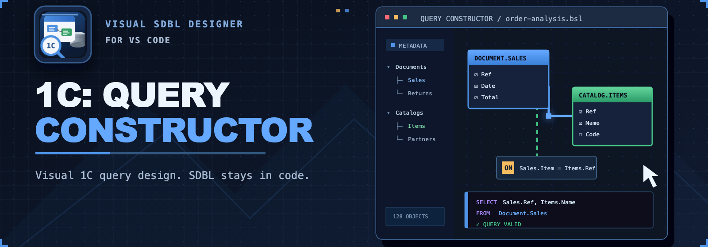
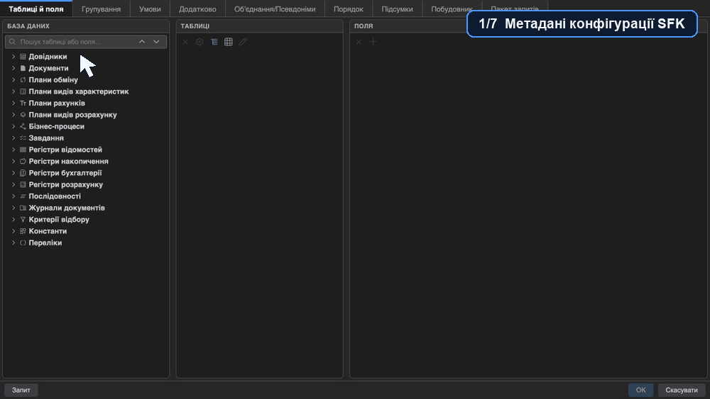

  

  
  
  
  
  
  
  
  

 

🧩 **1C: Query Constructor** is a VS Code extension for visually building and editing
metadata-aware 1C SDBL queries and inserting them as static BSL strings—without
connecting to a 1C database or executing the query.

## ✨ What it does

| Capability | Included tools |
| --- | --- |
| 🧩 **Visual query design** | Tables, fields, joins, conditions, grouping, ordering, and totals |
| 🧱 **Complex query structure** | Unions, temporary tables, batches, virtual-table parameters, and indexes |
| 🗂️ **Metadata-aware workflow** | Search, field types, and relationships from a 1C XML export |
| 🔄 **Round-trip editing** | Parse, validate, format, reopen, and replace supported static SDBL strings |
| 🧪 **Query text tools** | Comments, expression editing, and optional experimental Query Text v2 |
| 🌍 **Localized experience** | English, Ukrainian, and Russian UI and documentation |

## 🚀 Quick start

1. Install the extension from the [VS Code Marketplace](https://marketplace.visualstudio.com/items?itemName=SeredaLabs.query-console-1c).
2. Open a `.bsl` file and place the cursor in a static query or at an insertion point.
3. Open the editor context menu, select **1C: Query Constructor**, then choose
   **Query text only** or **With result-processing code**.
4. Build the query and select **OK** to insert or replace the BSL string.

> ⚠️ **Important:** The result-processing option generates a BSL wrapper. The
> extension does not connect to a 1C database or execute queries.

## 🗂️ Metadata setup

Set `queryConsole.metadataPath` to the `cf` directory of a file-based XML export,
or leave it empty to search the workspace for `Configuration.xml`. Run
**1C: Rebuild metadata index** after the export changes.

## ✅ Requirements

- VS Code 1.90 or later.
- A `.bsl` file open in the editor.
- A file-based XML export from 1C:Enterprise or BAS for metadata-aware work.

## ⚠️ Known boundaries

- Only supported static BSL query strings can be reopened.
- Validation is not a full 1C compiler.
- A small set of virtual-table parameter forms cannot be round-tripped safely.

See the [complete limitations](docs/en/limitations.md) before working with
complex or generated query text.

## 📚 Documentation

| Start here | Project resources |
| --- | --- |
| [User guide](docs/en/index.md) | [Development guide](docs/development/index.md) |
| [Getting started](docs/en/getting-started.md) | [Contributing](CONTRIBUTING.md) |
| [Query designer](docs/en/query-designer.md) | [Changelog](CHANGELOG.md) |
| [Troubleshooting](docs/en/troubleshooting.md) | [Known issues](docs/development/known-issues.md) |

## 💬 Feedback

Use [GitHub Issues](https://github.com/SeredaLabs/query-console-1c/issues) for
reproducible bugs and feature proposals. Do not attach proprietary configurations.

## 📄 License and credits

MIT — see [LICENSE](LICENSE). Third-party attributions are listed in
[THIRD-PARTY-NOTICES.md](THIRD-PARTY-NOTICES.md).

This project began as a fork of
[AlekseyUAM/query_console_vscode](https://github.com/AlekseyUAM/query_console_vscode)
and is now maintained independently by SeredaLabs.
