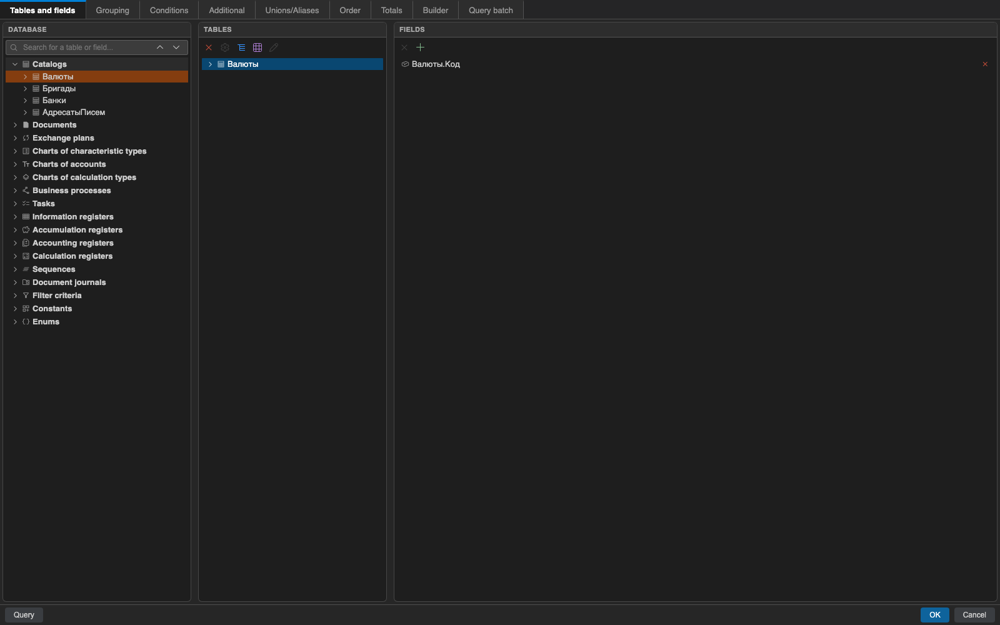

  

<h1 align="center">1C: Конструктор запитів</h1>

  <strong>Створюйте та редагуйте запити 1С SDBL візуально, не залишаючи VS Code.</strong>

  
  
  

  <a href="https://github.com/SeredaLabs/query-console-1c/blob/main/README.md">English</a> · <strong>Українська</strong> · <a href="https://github.com/SeredaLabs/query-console-1c/blob/main/README.ru.md">Русский</a>

Розширення читає файлове вивантаження конфігурації 1С, показує таблиці й поля
у візуальному конструкторі та записує результат як статичний BSL-рядок.
Підтримуваний запит під курсором можна знову відкрити для візуального редагування.

## ✨ Що вміє розширення

| Можливість | Доступні інструменти |
| --- | --- |
| 🧩 **Візуальне конструювання** | Таблиці, поля, з’єднання, умови, групування, сортування та підсумки |
| 🧱 **Складна структура запиту** | Об’єднання, тимчасові таблиці, пакети, параметри віртуальних таблиць та індекси |
| 🗂️ **Робота з метаданими** | Пошук, типи полів і зв’язки з файлового XML-вивантаження 1С |
| 🔄 **Повторне редагування** | Розбір, перевірка, форматування, відкриття та заміна підтримуваних статичних SDBL-рядків |
| 🧪 **Інструменти тексту запиту** | Коментарі, редактор виразів і необов’язковий експериментальний «Текст запиту v2» |
| 🌍 **Локалізований інтерфейс** | Англійська, українська та російська мови інтерфейсу й документації |

## 🚀 Швидкий старт

1. Установіть розширення з [VS Code Marketplace](https://marketplace.visualstudio.com/items?itemName=SeredaLabs.query-console-1c).
2. Відкрийте `.bsl` і поставте курсор у статичний запит або місце вставлення.
3. У контекстному меню редактора виберіть **1С: Конструктор запитів**, а потім
   **Лише текст запиту** або **З кодом обробки результату**.
4. Побудуйте запит і натисніть **ОК**, щоб вставити або замінити BSL-рядок.

> ⚠️ **Важливо:** Варіант з обробкою результату генерує BSL-обгортку.
> Розширення не підключається до бази 1С і не виконує запити.

## 🗂️ Налаштування метаданих

Укажіть у `queryConsole.metadataPath` каталог `cf` файлового XML-вивантаження
або залиште значення порожнім для пошуку `Configuration.xml` у робочій області.
Після зміни вивантаження виконайте команду **1С: Розібрати метадані в YAML**.

## ✅ Вимоги

- VS Code 1.90 або новіший.
- Відкритий у редакторі файл `.bsl`.
- Файлове XML-вивантаження з 1C:Enterprise або BAS для роботи з метаданими.

## ⚠️ Відомі обмеження

- Повторно відкрити можна лише підтримувані статичні BSL-рядки.
- Перевірка не є повним компілятором 1С.
- Деякі форми параметрів віртуальних таблиць не можна безпечно відтворити.

Перед роботою зі складним або згенерованим текстом перегляньте
[повний перелік обмежень](docs/uk/limitations.md).

## 📚 Документація

| Початок роботи | Ресурси проєкту |
| --- | --- |
| [Посібник користувача](docs/uk/index.md) | [Посібник розробника англійською](docs/development/index.md) |
| [Початок роботи](docs/uk/getting-started.md) | [Як зробити внесок](CONTRIBUTING.md) |
| [Конструктор запитів](docs/uk/query-designer.md) | [Журнал змін](CHANGELOG.md) |
| [Усунення проблем](docs/uk/troubleshooting.md) | [Відомі проблеми англійською](docs/development/known-issues.md) |

## 💬 Зворотний зв’язок

Повідомляйте про відтворювані помилки та пропозиції у
[GitHub Issues](https://github.com/SeredaLabs/query-console-1c/issues). Не додавайте
конфіденційні конфігурації.

## 📄 Ліцензія та авторство

MIT — див. [LICENSE](LICENSE). Атрибуцію сторонніх матеріалів наведено у
[THIRD-PARTY-NOTICES.md](THIRD-PARTY-NOTICES.md).

Проєкт розпочався як форк
[AlekseyUAM/query_console_vscode](https://github.com/AlekseyUAM/query_console_vscode)
і тепер незалежно підтримується SeredaLabs.
