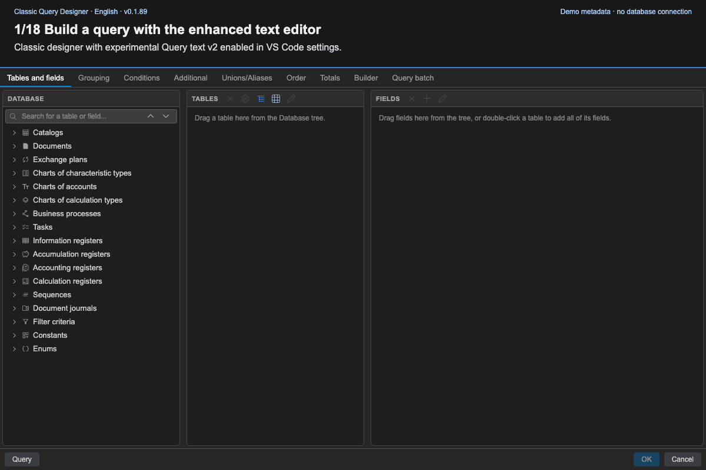

<!--
source_version: 5
translation_status: canonical
-->

# 🧩 Using the query designer

[English](../en/query-designer.md) · [Українська](../uk/query-designer.md) · [Русский](../ru/query-designer.md)

## 🏗️ Build the query

Use **Tables and fields** to select sources and output fields. The metadata tree
supports multi-word search. Selected tables expose their fields, aliases, and
virtual-table parameters.

Use the remaining tabs for joins, conditions, grouping, ordering, totals,
unions, indexes, and additional query options. **Batch** manages multiple
statements, temporary tables, and their order. **Builder** helps assemble
expressions from fields, operators, functions, and parameters.

## 🔍 Review generated text

Open **Query text** to inspect generated SDBL. The default editor provides syntax
highlighting. Enable `queryConsole.queryTextEditorV2` for the enhanced experimental
editor shown in the demo: formatting, search, validation markers, query structure,
and parameter panels.

Applying a manual text edit parses it back into the visual `QueryModel`. If the
text is outside the supported grammar, the designer reports an error and keeps
the prior model.

## ✅ Finish

Select **OK** to send the generated source to the active editor. Select **Cancel**
to discard designer changes. A metadata-cache refresh changes the available
metadata but does not edit the current BSL file.

## 🎬 Demo walkthrough

[Watch the video (WebM)](../videos/query-constructor-demo.en.webm).
The recording uses the current Classic WebView and the small E2E metadata fixture,
with **Query text v2** enabled (`queryConsole.queryTextEditorV2: true`). It does not
require a private configuration.

1. Search for `Валюты Наим`: words can match both a table and its field.
2. Drag `Наименование` into **Fields**. Its source table is added automatically.
3. Double-click the selected `Валюты` table to add all fields. Repeats are allowed:
   the repeated `Наименование` is generated with the alias `Наименование1`.
4. Use **+** in **Fields** to open the new **Custom expression** editor. Search
   for a field and double-click it to insert it and see its type. Select the text,
   search for `ЕСТЬNULL`, and insert its template with inline syntax help.
   Type `Валюты.`, choose a field from completion, and use **Tab** for the next
   argument. An unfinished expression shows a syntax error and disables formatting;
   diagnostics do not disable **OK** in this dialog. Correct the expression to
   `ЕСТЬNULL(Валюты.Наименование, "-")` and save it as an output field.
5. Open **Query** in the enhanced text editor. **Structure** shows output fields
   and sources next to the SDBL. Add `ГДЕ Валюты.Код = &Код` and descending order,
   then use **Format** and **Validate** on the toolbar.
6. Open **Parameters** to see `&Код` and its use count. Click the parameter to
   navigate to its line, then **Apply** the text changes.
   Inspect **Conditions** and **Order** to see the text changes in the visual model.
7. Try an unknown source table. Validation shows a diagnostic and an error marker;
   applying the edit keeps the previous model. Close the dialog, confirm **Close
   without saving**, and reopen **Query**: the previous valid model is preserved.
8. **OK** sends SDBL to the extension host for insertion into BSL; it does not run
   a database query. The browser recording does not show VS Code editor insertion.

The interface and captions follow the documentation language. Metadata identifiers
and SDBL keywords remain unchanged. Experimental Canvas is not enabled in this
recording. Query text v2 is explicitly enabled for every text-editing scene; the
custom expression editor is available without that setting.
