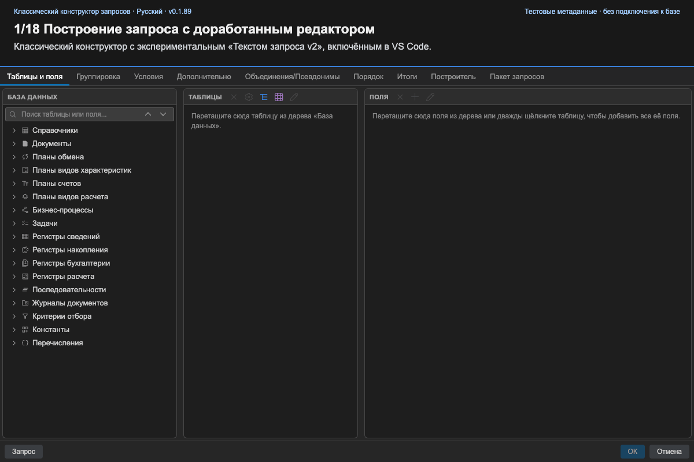

<!--
source_version: 5
translation_status: current
-->

# 🧩 Работа с конструктором запросов

[English](../en/query-designer.md) · [Українська](../uk/query-designer.md) · [Русский](../ru/query-designer.md)

## 🏗️ Построение запроса

В разделе **Таблицы и поля** выберите источники и выходные поля. Дерево
метаданных поддерживает поиск по нескольким словам. Для таблиц доступны поля,
псевдонимы и параметры виртуальных таблиц.

Остальные вкладки управляют соединениями, условиями, группировкой, сортировкой,
итогами, объединениями, индексами и дополнительными параметрами. **Пакет**
управляет несколькими операторами и временными таблицами. **Конструктор
выражения** помогает работать с полями, операторами, функциями и параметрами.

## 🔍 Проверка сгенерированного текста

Откройте **Текст запроса**, чтобы просмотреть SDBL. Стандартный редактор имеет
подсветку. Включите `queryConsole.queryTextEditorV2`, чтобы получить показанный
в демонстрации доработанный экспериментальный редактор: форматирование, поиск,
маркеры проверки и панели структуры и параметров.

Ручные изменения текста разбираются обратно в `QueryModel`. Если грамматика не
поддерживается, конструктор показывает ошибку и сохраняет предыдущую модель.

## ✅ Завершение

Нажмите **ОК**, чтобы передать код в редактор, или **Отмена**, чтобы отбросить
изменения. Обновление кеша метаданных не редактирует текущий BSL-файл.

## 🎬 Сценарий демонстрации

[Посмотреть видео (WebM)](../videos/query-constructor-demo.ru.webm).
Запись использует актуальный Classic WebView, небольшой набор метаданных из E2E-тестов
и включённый **Текст запроса v2** (`queryConsole.queryTextEditorV2: true`).
Приватная конфигурация не нужна.

1. Найдите `Валюты Наим`: слова могут соответствовать и таблице, и её полю.
2. Перетащите `Наименование` в **Поля**. Исходная таблица добавится автоматически.
3. Дважды щёлкните выбранную таблицу `Валюты`, чтобы добавить все поля. Повторы разрешены:
   повторное `Наименование` генерируется с псевдонимом `Наименование1`.
4. Нажмите **+** в панели **Поля**, чтобы открыть новый редактор **Произвольное выражение**.
   Найдите поле и дважды щёлкните его, чтобы вставить и увидеть тип. Выделите текст,
   найдите `ЕСТЬNULL` и вставьте шаблон со встроенной справкой по синтаксису.
   Наберите `Валюты.`, выберите поле из подсказок и нажмите **Tab** для второго
   аргумента. Незавершённое выражение показывает синтаксическую ошибку и отключает
   форматирование; диагностика не блокирует **ОК** в этом диалоге. Исправьте выражение
   на `ЕСТЬNULL(Валюты.Наименование, "-")` и сохраните как поле результата.
5. Откройте **Запрос** в доработанном редакторе. **Структура** показывает поля
   результата и источники рядом с SDBL. Добавьте `ГДЕ Валюты.Код = &Код` и сортировку
   по убыванию, нажмите **Форматировать** и **Проверить** на панели инструментов.
6. Откройте **Параметры**, чтобы увидеть `&Код` и число использований. Щёлкните
   параметр для перехода к его строке, затем нажмите **Применить**.
   Проверьте **Условия** и **Порядок**: правки уже в модели.
7. Попробуйте неизвестную исходную таблицу. Проверка показывает диагностику и маркер
   ошибки; применение правки сохраняет прежнюю модель. Закройте диалог, подтвердите
   **Закрыть без сохранения** и снова откройте **Запрос**: корректная модель сохранена.
8. **ОК** передаёт SDBL хосту расширения для вставки в BSL, а не выполняет запрос
   к базе. Браузерная запись не показывает вставку в редактор VS Code.

Язык интерфейса и пояснений соответствует языку документации. Идентификаторы метаданных
и ключевые слова SDBL не меняются. Экспериментальный Canvas в этой записи выключен.
«Текст запроса v2» явно включён во всех сценах редактирования текста; редактор
произвольных выражений доступен и без этой настройки.
