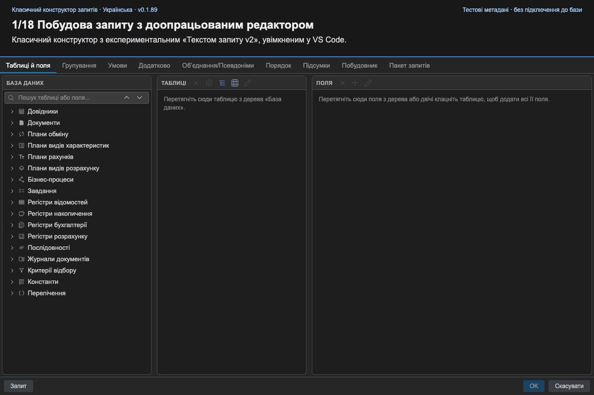

<!--
source_version: 6
translation_status: current
-->

# 🧩 Робота з конструктором запитів

[English](../en/query-designer.md) · [Українська](../uk/query-designer.md) · [Русский](../ru/query-designer.md)

Наведені нижче інструкції з вкладками описують Classic; Canvas Preview має окремий workflow.

## 🏗️ Побудова запиту

У розділі **Таблиці й поля** виберіть джерела та вихідні поля. Дерево метаданих
підтримує пошук за кількома словами. Для таблиць доступні поля, псевдоніми та
параметри віртуальних таблиць.

Інші вкладки керують з’єднаннями, умовами, групуванням, сортуванням, підсумками,
об’єднаннями, індексами й додатковими параметрами. **Пакет** керує кількома
операторами та тимчасовими таблицями. **Конструктор виразу** допомагає з полями,
операторами, функціями й параметрами.

## 🔍 Перевірка згенерованого тексту

Відкрийте **Текст запиту**, щоб переглянути SDBL. Стандартний редактор має
підсвічування. Увімкніть `queryConsole.queryTextEditorV2`, щоб отримати показаний
у демонстрації доопрацьований експериментальний редактор: форматування, пошук,
маркери перевірки та панелі структури й параметрів.

Ручні зміни тексту розбираються назад у `QueryModel`. Якщо граматика не
підтримується, конструктор показує помилку та зберігає попередню модель.

## ✅ Завершення

Натисніть **ОК**, щоб передати код у редактор, або **Скасувати**, щоб відкинути
зміни. Оновлення кешу метаданих не редагує поточний BSL-файл.

## 🧪 Canvas Preview

Увімкніть `queryConsole.enableNewBuilderPreview` і виконайте **1C: Новий конструктор (Preview)**.
Шість робочих просторів керують структурою, полями, умовами, групуванням,
сортуванням і додатковими параметрами; пакет/UNION використовують модель Classic.
Увійдіть у підзапит-джерело для рекурсивного редагування: **Назад** перевіряє і
приймає draft, **Скасувати** залишає батьківський запит незмінним. Доступні основні
форми VT, описи зовнішніх тимчасових таблиць, підсумки/індекси й редактор виразів.

Панель згенерованого SDBL має підсвічування, копіювання, зміну розміру та згортання;
текст у ній лише для читання. **Зберегти** вставляє перевірений текст і не виконує
запит. Складні завантажені форми можуть лише зберігатися без окремих controls;
див. [актуальну матрицю](../design/new-builder/feature-baseline.md) та [обмеження](limitations.md).
Функціональний baseline відокремлено від UX/accessibility і готовності релізу,
тому Preview вмикається лише за вибором користувача.

## 🎬 Сценарій демонстрації

[Переглянути відео (WebM)](../videos/query-constructor-demo.uk.webm).
Запис використовує актуальний Classic WebView, невеликий набір метаданих з E2E-тестів
й увімкнений **Текст запиту v2** (`queryConsole.queryTextEditorV2: true`).
Приватна конфігурація не потрібна.

1. Знайдіть `Валюты Наим`: слова можуть відповідати і таблиці, і її полю.
2. Перетягніть `Наименование` до **Поля**. Таблиця-джерело додасться автоматично.
3. Двічі клацніть вибрану таблицю `Валюты`, щоб додати всі поля. Повтори дозволені:
   повторне `Наименование` генерується з псевдонімом `Наименование1`.
4. Натисніть **+** у панелі **Поля**, щоб відкрити новий редактор **Довільний вираз**.
   Знайдіть поле й двічі клацніть його, щоб вставити та побачити тип. Виділіть текст,
   знайдіть `ЕСТЬNULL` і вставте шаблон із вбудованою довідкою про синтаксис.
   Наберіть `Валюты.`, виберіть поле з підказок і натисніть **Tab** для другого
   аргументу. Незавершений вираз показує синтаксичну помилку й вимикає форматування;
   діагностика не блокує **ОК** у цьому діалозі. Виправте вираз на
   `ЕСТЬNULL(Валюты.Наименование, "-")` та збережіть як поле результату.
5. Відкрийте **Запит** у доопрацьованому редакторі. **Структура** показує поля
   результату та джерела поруч із SDBL. Додайте `ГДЕ Валюты.Код = &Код` і сортування
   за спаданням, натисніть **Форматувати** та **Перевірити** на панелі інструментів.
6. Відкрийте **Параметри**, щоб побачити `&Код` і кількість використань. Клацніть
   параметр для переходу до його рядка, потім натисніть **Застосувати**.
   Перегляньте **Умови** та **Порядок**: правки вже в моделі.
7. Спробуйте невідому таблицю-джерело. Перевірка показує діагностику й маркер помилки;
   застосування правки зберігає попередню модель. Закрийте діалог, підтвердьте
   **Закрити без збереження** й знову відкрийте **Запит**: коректна модель збережена.
8. **ОК** передає SDBL хосту розширення для вставлення в BSL, а не виконує запит
   до бази. Браузерний запис не показує вставлення в редактор VS Code.

Мова інтерфейсу й пояснень відповідає мові документації. Ідентифікатори метаданих
і ключові слова SDBL не змінюються. Експериментальний Canvas у цьому записі вимкнений.
«Текст запиту v2» явно увімкнений у всіх сценах редагування тексту; редактор
довільних виразів доступний і без цього налаштування.
